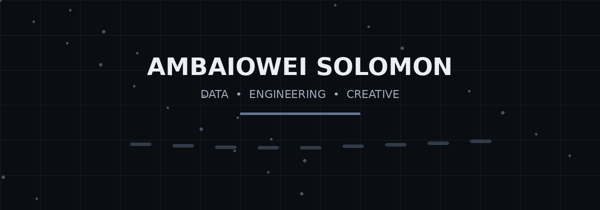
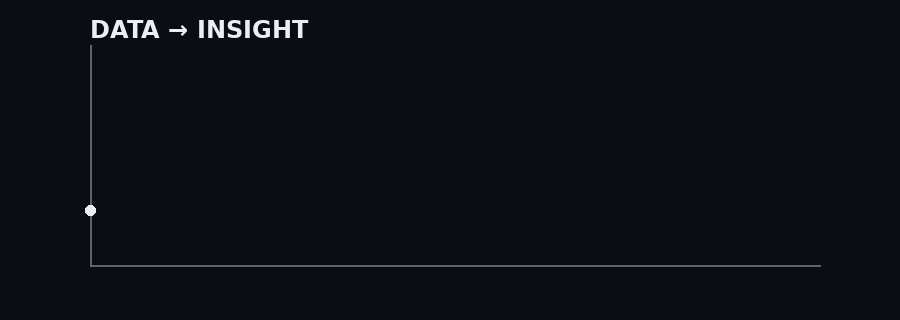
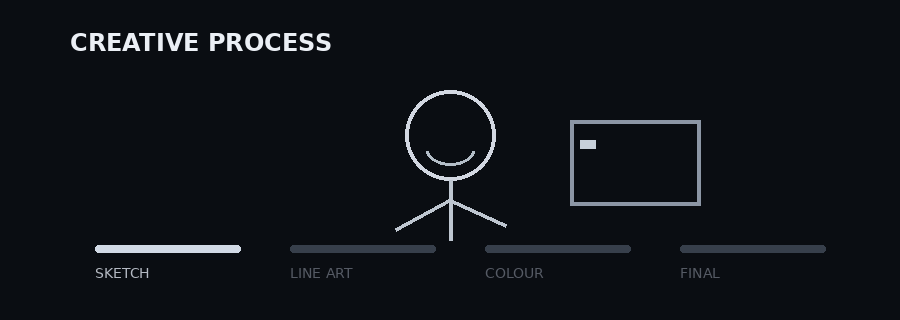

# AMBAIOWEI SOLOMON

  

  <b>Data Scientist & Creative Technologist</b> 
  Data • Engineering • Visual Storytelling

  <a href="YOUR_PORTFOLIO_URL">Portfolio</a> •
  <a href="YOUR_LINKEDIN_URL">LinkedIn</a> •
  <a href="YOUR_EMAIL">Contact</a>

---

## 👋 About Me

I'm a Computer Science student focused on **Data Science and Analytics**, with an interest in building software systems around data.

I work across three connected areas:

- 📊 **Data** — analysis, machine learning, visualization and business intelligence
- 💻 **Engineering** — web applications, backend systems, APIs, databases and cloud
- 🎨 **Creative** — digital illustration, visual design and visual storytelling

I like turning raw information and ideas into things that are **useful, understandable and visually engaging**.

---

## 🧭 What I Do

| 📊 Data | 💻 Engineering | 🎨 Creative |
|---|---|---|
| Data Analysis | Web Development | Digital Illustration |
| Machine Learning | Backend Development | Visual Design |
| Predictive Analytics | APIs | Visual Storytelling |
| Data Visualization | Databases | Animation |
| Business Intelligence | Cloud | Creative Technology |

---

## 🛠️ Tech Stack

### Data & Machine Learning
`Python` `Pandas` `NumPy` `Scikit-learn` `XGBoost` `SHAP` `Matplotlib` `Seaborn`

### Analytics & BI
`SQL` `Power BI` `DAX` `Excel`

### Engineering
`HTML` `CSS` `JavaScript` `React` `Flask` `Git` `GitHub`

### Databases & Cloud
`MySQL` `PostgreSQL` `SQL Server` `Azure`

### Exploring
`Cairo` `Starknet` `Web3` `Cloud Computing`

---

# 🚀 Featured Work

### 📊 Data Science

> **From raw data → analysis → insight → model → visualization**

  

**Featured projects**

- **LA Crime Analysis** — exploratory analysis and visualization of crime data
- **Blinkit / Reign Tech Analysis** — data cleaning, exploration and business insights
- **Machine Learning Projects** — predictive modelling, feature engineering and model interpretation

---

### 💻 Engineering

I build applications and systems that connect data, users and useful functionality.

**Focus areas**

`Frontend` → `Backend` → `API` → `Database` → `Cloud`

Selected technologies include **React, Flask, JavaScript, SQL and Azure**.

---

### 🎨 Creative Technology

  

My creative work includes digital illustration, visual design and experimenting with ways technology can make visual experiences more interactive.

---

## 📈 GitHub Activity

<!-- Add your GitHub statistics here later -->

  
  

---

## 🔗 Connect

  <a href="YOUR_PORTFOLIO_URL">Portfolio</a> •
  <a href="YOUR_LINKEDIN_URL">LinkedIn</a> •
  <a href="YOUR_EMAIL">Email</a>

  Data • Engineering • Creativity

