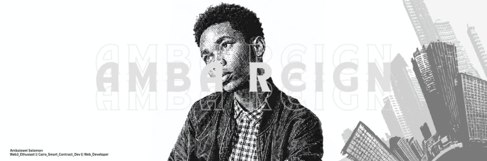

  
  
  <h1>Hi there, I'm Ambaiowei Solomon</h1>
  
   

  <!-- Social Badges -->
    

---

## About Me

I'm a Computer Science student focused on **Data Science and Analytics**, with a strong interest in building scalable software systems around data. 

I work across three connected areas:
- **Data** — analysis, machine learning, visualization, and business intelligence
- **Engineering** — web applications, backend systems, APIs, databases, and cloud
- **Creative** — digital illustration, visual design, and visual storytelling

I like turning raw information and ideas into things that are **useful, understandable, and visually engaging**.

---

## What I Do

<table align="center">
  <tr>
    <td align="center" width="33%"><b>Data</b></td>
    <td align="center" width="33%"><b>Engineering</b></td>
    <td align="center" width="33%"><b>Creative</b></td>
  </tr>
  <tr>
    <td align="center">Data Analysis Machine Learning Predictive Analytics Data Visualization Business Intelligence</td>
    <td align="center">Web Development Backend & APIs Databases Cloud Computing Web3 & Cairo</td>
    <td align="center">Digital Illustration Visual Design Visual Storytelling Animation Creative Technology</td>
  </tr>
</table>

---

## Tech Stack

### Data & Machine Learning
`Python` `Pandas` `NumPy` `Scikit-learn` `XGBoost` `SHAP` `Matplotlib` `Seaborn`

### Analytics & BI
`SQL` `Power BI` `DAX` `Excel`

### Engineering
`HTML` `CSS` `JavaScript` `React` `Flask` `Git` `GitHub`

### Databases & Cloud
`MySQL` `PostgreSQL` `SQL Server` `Azure`

### Exploring
`Cairo` `Starknet` `Web3` `Cloud Computing`

---

## Featured Work

### Data Science
> **From raw data → analysis → insight → model → visualization**

  

 

* **LA Crime Analysis** — exploratory analysis and visualization of crime data
* **Blinkit / Reign Tech Analysis** — data cleaning, exploration and business insights
* **Machine Learning Projects** — predictive modelling, feature engineering and model interpretation

### Engineering
I build applications and systems that connect data, users and useful functionality. 
`Frontend` → `Backend` → `API` → `Database` → `Cloud`

### Creative Technology

  

 

My creative work includes digital illustration, visual design and experimenting with ways technology can make visual experiences more interactive.

---

## GitHub Stats

  
  

